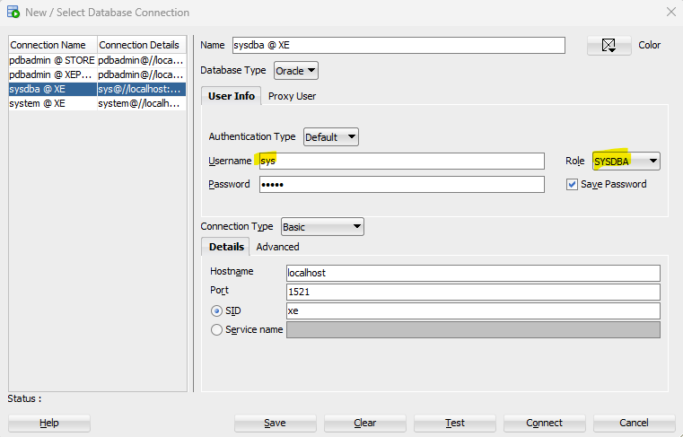

# Oracle Container Registry
https://container-registry.oracle.com/ords/f?p=113:10::::::

# Database Repositories
https://container-registry.oracle.com/ords/f?p=113:1:16603459678174:::1:P1_BUSINESS_AREA:3&cs=3fQ4_hd6eFl0noB6XNx_Tmw7lEUfSnV6y8Aag5i74F6pjIRgNWoNbz0BoJPCH4gno-4BsdcRS973qxn7-o1SbSQ

# Oracle Database XE Release 21c (21.3.0.0) Docker Image Documentation
https://container-registry.oracle.com/ords/f?p=113:4:112321219908969:::4:P4_REPOSITORY,AI_REPOSITORY,AI_REPOSITORY_NAME,P4_REPOSITORY_NAME,P4_EULA_ID,P4_BUSINESS_AREA_ID:803,803,Oracle%20Database%20Express%20Edition,Oracle%20Database%20Express%20Edition,1,0&cs=3qLdLrhw6x3L8HEa1To8llov01YOy9Cc1-5i-yy3wEv5P1RZBfuGvt3ZwKv_UViQ7CUWVwisauaXW1LsxRPvnIg

# Start Docker container
docker container run -d --rm --privileged `
--name oracle-xe `
-p 1521:1521 -p 5500:5500 `
-e ORACLE_PWD=admin `
-v "C:\Users\TO11RC\OneDrive - ING\miel\workspace\Oracle:/opt/oracle/oradata" `
container-registry.oracle.com/database/express:21.3.0-xe

# Start a bash shell
docker exec -it oracle-xe bash

# sqlplus
sqlplus / as sysdba

# Set password for sys, system users
sqlplus / as sysdba
alter user sys identified by admin;
alter user system identified by admin;

sqlplus sys/admin@XE as sysdba
sqlplus system/admin@XE

# Set password for pdbadmin user
sqlplus / as sysdba
alter session set container = XEPDB1;
alter user pdbadmin identified by admin;

sqlplus pdbadmin/admin@XEPDB1

# Set permissions for pdbadmin
sqlplus / as sysdba
alter session set container=XEPDB1;
grant pdb_dba to pdbadmin;
alter user pdbadmin quota unlimited on users;

# Create a new PDB by cloning an existing PDB
sqlplus / as sysdba

-- Ensure the source PDB is open in read-only mode. Please note that XEPDB1 is now in read only mode change it back to 'open' if you want to make changes...
alter pluggable database XEPDB1 close immediate;
alter pluggable database XEPDB1 open read only;

-- Create the new PDB by cloning
create pluggable database STORE from XEPDB1 file_name_convert = ('/opt/oracle/oradata/XE/XEPDB1/', '/opt/oracle/oradata/XE/STORE/');

-- Open the new PDB
alter pluggable database STORE open;

# List pdb's states
select * from v$pdbs;
select name, open_mode from v$pdbs;

